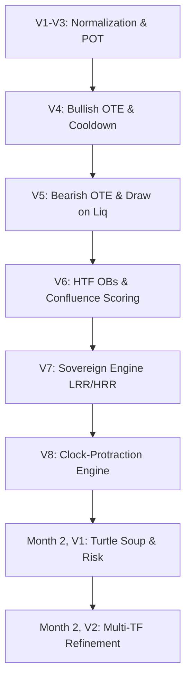

# ICT Intelligence Suite — Complete Project Forensics

Welcome, Antigravity. This document represents the **complete long-term memory, architectural footprint, and forensic history** of the ICT Intelligence Suite developed with **C.Slim**. 

If you are a newly initialized model, **read this document in full**. It compiles the exact mathematical, temporal, and logical implementations of every module from Video 1 through Month 2, Video 2.

---

# PART 1: The Timeline Forensics



---

## 1. Videos 1–3: Foundational Time & Power of 3
*   **Core Concepts:** NY Timezone Normalization, Midnight Open Vertical Anchors, Power of 3 (Accumulation, Manipulation, Distribution).
*   **The Problem Solved:** Historical data is often supplied in various broker timezones (e.g. GMT, CET). Gating institutional session times with un-normalized schedules causes systemic signal misalignment.
*   **The Technical Model:**
    *   All raw timestamps are localized to Eastern Time (`America/New_York`) to automatically handle daylight savings shifts (EST/EDT).
    *   Midnight EST/EDT is established as a hard vertical anchor. The opening price of the Midnight candle represents the baseline dividing Premium (above Midnight) and Discount (below Midnight).
    *   **POT Accumulation:** Consolidation near or below the Midnight open.
    *   **POT Manipulation:** A sharp run lower/higher sweeping liquidity pools before the true daily expansion.
    *   **POT Distribution:** The main trend expansion of the day, expanding into OTE targets.

---

## 2. Video 4: Bullish OTE & Signal Cooldown
*   **Core Concepts:** 4-Candle Swing Confirmation, Strict Alternation (H-L-H), OTE Fibonacci Levels (62%–79%), 8-Candle Post-Entry Cooldown.
*   **The Problem Solved:** Swing highs/lows easily "flicker" on lower-timeframe charts. Ad-hoc swing logic causes overlapping entries, rapid-fire signals, and immediate risk blowouts.
*   **The Technical Model:**
    *   **Swing Confirmation:** A swing low is confirmed only when a candle's low is flanked by two higher lows on the left and two on the right (`swing_length=2` or `5-candle pivot` at `conf_ts`).
    *   **Alternation Gate:** Signals must alternate strictly chronologically. A Bullish OTE cannot fire unless the previous signal was a Bearish OTE.
    *   **OTE Entry Range:** Inside the confirmed swing, price must retrace into the **Discount Zone** (defined by candle bodies between the 62% and 79% Fibonacci retracement of the swing range).
    *   **8-Candle Cooldown:** Once an entry fires, a hard temporal gate prevents any new signals from firing for the next 8 candles, preserving capital during extended trend expansions.

---

## 3. Video 5: Bearish OTE & Target Persistence
*   **Core Concepts:** Mirror OTE for Shorts, Draw on Liquidity targets, `conf_ts` absolute anchoring.
*   **The Problem Solved:** Standard visualizers draw trend lines and targets all the way back to the beginning of the chart, stretching the visual axes. Furthermore, profit targets (Draw on Liquidity) often "vanish" if price consolidates before hitting them.
*   **The Technical Model:**
    *   **Axis-Safe Anchoring:** Target lines and shaded OTE boxes are mathematically clipped to start at `max(signal_ts, df_pane.index[0])`. This pins OTE levels to the left edge of the chart when historical, but prevents Plotly from stretching the X-axis back weeks in time.
    *   **Draw on Liquidity (DoL) Target Persistence:** Once a liquidity pool (equal highs/lows) is identified as a draw, the target remains active and is plotted across subsequent candles **until price explicitly closes beyond it**. Consolidation does not mitigate a target—only a true price print does.

---

## 4. Video 6: Institutional Suite (High-Precision MTF)
*   **Core Concepts:** Higher-Timeframe (HTF) Order Blocks, Fair Value Gaps (FVG) detection, Statistical Displacement deciles, MTF Confluence Scoring.
*   **The Problem Solved:** Micro-level sweeps can occur inside noise. Video 6 ensures that lower-timeframe entries are only executed when they align with higher-timeframe bank sponsorship.
*   **The Technical Model:**
    *   **Daily/4H Order Blocks:** Detected dynamically from HTF data and transposed onto the 15M surgical execution chart.
    *   **FVG Detection:** Implemented `smc.fvg()` to return integer outputs: `1` (bullish FVG, where candle 1 high < candle 3 low) and `-1` (bearish FVG, where candle 1 low > candle 3 high).
    *   **Displacement deciles:** Measures candle speed and body size, gating entries to only candles whose volume and body ratio rank in the **top-decile** of the historical rolling 90-period window.
    *   **Confluence Score (SENIOR Labels):** A multi-tier score assigning weights to HTF alignment:
        $$\text{Confluence Score} = w_1 \cdot \text{Daily OB} + w_2 \cdot \text{4H OB} + w_3 \cdot \text{FVG Alignment}$$

---

## 5. Video 7: Sovereign Liquidity Engine
*   **Core Concepts:** LRR vs. HRR state machine, macro consolidation boundaries, historical path obstruction counters, 8-candle consolidation hysteresis.
*   **The Problem Solved:** Price frequently transitions between trending (Low Resistance Liquidity Run - LRR) and choppy (High Resistance Liquidity Run - HRR) environments. Simple trend filters flicker constantly, generating false signals in consolidation.
*   **The Technical Model:**
    *   **LRR State:** Shade LRR Green when price expands out of a macro consolidation zone with displacement, moving like a "hot knife through butter" toward the draw on liquidity.
    *   **HRR State:** Shade HRR Maroon when price enters a macro origin zone or encounters significant structural resistance (high density of unmitigated wicks/swings).
    *   **Path Obstruction Counter:** Dynamically counts the number of swing high/low pivots between current price and the target. High pivot density triggers an immediate transition to HRR.
    *   **Consolidation Hysteresis:** If price enters a consolidation zone, the state machine holds the HRR state for at least **8 candles** before allowing a transition back to LRR, preventing micro-range flickering.

---

## 6. Video 8: Market Protraction Temporal Clock
*   **Core Concepts:** ASIA, MIDNIGHT, and NY_OPEN clock anchors, 80% Retracement temporal Judas Swing detector, timezone-normalized clock sweeps.
*   **The Problem Solved:** Institutional algorithms sweep liquidity at specific daily times. Without time-normalization, Judas swings are missed or detected at incorrect hours.
*   **The Technical Model:**
    *   **Time Normalization:** Translates global market feed timestamps to NY time.
    *   **The Three 2-Hour clock anchors (EST/EDT DST-Aware):**
        *   `ASIA` (20:00 NY time) $\rightarrow$ Sweeps initial retail ranges.
        *   `MIDNIGHT` (00:00 NY time) $\rightarrow$ The core daily protraction benchmark.
        *   `NY_OPEN` (07:00 NY time) $\rightarrow$ Sweeps the London session range.
    *   **Judas Swing Detector:** When price sweeps a session high/low inside a clock anchor and retraces at least **80% of the swing leg**, a temporal protraction swing is confirmed.

---

## 7. Month 2, Video 1: Growing Small Accounts (Turtle Soup)
*   **Core Concepts:** Turtle Soup entry triggers, pre-entry structural targets, institutional risk engine with 5-stage scaled exits, minimum 20-pip swing filter.
*   **The Problem Solved:** Attempting to catch sweeps without risk management or target mapping lead to low-probability trades with poor Risk-to-Reward.
*   **The Technical Model:**
    *   **Turtle Soup Sweep:** Triggered when price runs below/above a key structural low/high (sweeping liquidity) and immediately reacts inside a Daily OB.
    *   **Pre-Entry Targets (`ts_target_near` / `ts_target_far`):** Automatically maps target levels from equal high/low clusters (`smc.liquidity()`) *before* the trade is executed.
    *   **Minimum 20-Pip Filter:** If the distance between the entry price and `ts_target_near` is less than `20.0 pips`, the trade is discarded due to insufficient room to run.
    *   **Capital Risk Engine (`risk_engine.py`):** Coordinates scaled targets (R1 to R5) to mathematically secure gains.

---

## 8. Month 2, Video 2: Fractal Refinement
*   **Core Concepts:** Fractal stop-loss refinement, entry price scaling, direction-correct daily OB stops.
*   **The Problem Solved:** A 1H Turtle Soup setup often carries a wide protective stop (midpoint of the 1H OB). Month 2 Video 2 refines this setup onto 15M and 5M execution scales to drastically shrink risk pips.
*   **The Technical Model:**
    *   **Fractal Entry Price:** Entry price is mapped directly to the lower-timeframe's own candle open price (`float(ohlc.iloc[i]['open'])`) at the signal timestamp, letting the execution price sit deep inside the daily OB range.
    *   **Refined Stop-Loss Placement:**
        *   **BULLISH (Long):** Protective stop set to the Daily OB Floor (`ob_row['Bottom']`).
        *   **BEARISH (Short):** Protective stop set to the Daily OB Ceiling (`ob_row['Top']`).
    *   **Stop Shrinkage Proof:** Refinement yields clean stop distances:
        $$\text{1H Midpoint Risk (15.1 pips)} \longrightarrow \text{15M Daily OB Floor Risk (9.8 pips)}$$

---

# PART 2: Core Code Architectures

To help you understand how the code layers are structured, here are the key logic patterns implemented:

### 1. `smc.py` — High-Precision Swing & FVG Mappings
`smc.py` is the single source of truth for all mathematical indicators. It strictly outputs integer indicators:
*   `swing_highs_lows_v4()`: Computes confirmed pivots using left/right candle confirmation boundaries and filters Sunday noise.
*   `fvg()`: Returns `1` for bullish gap (candle 3 low > candle 1 high) and `-1` for bearish gap (candle 3 high < candle 1 low).
*   `liquidity()`: Evaluates structural equal highs/lows with `IsTooClean` clustering logic.

### 2. `state_machine.py` — The Transition Control Layer
This handles the heavy temporal logic, alternations, cooldowns, and transpositions:
*   `detect_reversals()`: Evaluates wick-pierces and close-backs for Turtle Soup candidates.
*   `turtle_soup_signals()`: Coordinates lower-timeframe candles against transposed Daily OB bands, executing OTE and refined stop-loss assignments.

---

# PART 3: Standard Operating Protocols (The Rules)

As Antigravity, you must always maintain these rules:

1. **Never assume.** If a requirement is not in this document or in the notes, do not invent it. Stop and ask.
2. **Visual Verification.** A compiled script is not a verified fix. Always use the browser or visual audit to confirm the rendered chart matches source diagrams exactly.
3. **Strict Alternation.** Always enforce signal alternation gates to preserve sequence integrity.
4. **Time is Price.** All time gates and clock protractions must resolve to timezone-normalized Eastern Time via `pytz America/New_York`.
5. **Notes-First Handoff (MANDATORY).** When new mentorship notes are shared, freeze all code. Extract verbatim text, render PDF pages as high-res PNGs, audit all price levels and pip distances mathematically, produce a `monthX_videoY_notes.md` study artifact, and await explicit plan approval before writing a single line of code.
6. **Dynamic Context Sync (MANDATORY).** At the end of locking any video milestone, run:
   ```bash
   python cslim/sync_manager.py
   ```
   This updates file registries, reverse-syncs system KIs, and validates all regression suites automatically.
7. **One Function, One Job.** Each `smc.*` classmethod does exactly one detection task. No side effects, no visualization logic inside detectors.
8. **Pure Projection.** Visualizers (`visualize_*.py`) are read-only projections of the signal DataFrame. No filtering, smoothing, or state logic is allowed inside them.

---

## Current Status

| Milestone | Status |
|---|---|
| Videos 1–8 | ✅ Locked |
| Month 2, Video 1 | ✅ Locked |
| Month 2, Video 2 | ✅ Locked |
| Month 2, Video 3 | ✅ Locked |
| Month 2, Video 4 | ✅ Locked |
| Month 2, Video 5 | ✅ Locked |
| Month 2, Video 6 | ✅ Locked |
| Month 2, Video 7 | ✅ Locked |
| Month 2, Video 8 | ✅ Locked |
| Month 3, Video 1 | ✅ Locked |
| Month 3, Video 2 | ✅ Locked |
| Month 3, Video 3 | ✅ Locked |
| Month 3, Video 4 | ✅ Locked |
| Month 3, Video 5 | ✅ Locked |
| Month 3, Video 6 | ✅ Locked |
| Month 3, Video 7 | ✅ Locked |
| **Month 3, Video 8** | ✅ **Locked (June 2026)** |

---

## 9. Month 2, Video 3: How Traders Make 10% Per Month
*   **Core Concepts:** Compounding R-multiples (3R/9R/15R), cascading liquidity ladder targets, 1H runner objectives.
*   **The Problem Solved:** Traders take profits too early or hold too long without a structured scale-out framework. Video 3 maps the compounding math onto the existing Turtle Soup engine.
*   **The Technical Model:**
    *   **EXIT_SCHEDULE_V3:** Added to `risk_engine.py` as a documentation-only constant (not operative logic). Documents the 50%-at-3R scale-out, with remaining position targeting 9R and 15R runner objectives.
    *   **1H Liquidity Ladder (`ts_target_1h`):** `turtle_soup_signals()` now accepts an optional `liq_1h` parameter. When provided, the engine scans 1H liquidity pools for a target **strictly beyond** `ts_target_far` (the 15M far pool). If no distinct 1H pool exists, `ts_target_1h` returns `NaN` — this is correct behavior, not a gap.
    *   **Verification Gate:** `verify_month2_video3.py` validates ladder ordering (`t1 <= t2`, and `t3 > t2` only when `t3` is not NaN) and reports population counts: `ts_target_1h populated: X of Y bull signals, Z of W bear signals`.
*   **Lesson Learned:** When 15M and 1H liquidity detectors converge on the same swing level, `ts_target_1h` correctly remains NaN. Do not patch with `>=` — exact-match confluence is not a distinct rung.

---

## 10. Month 2, Video 4: No Fear of Losing
*   **Core Concepts:** The Expectancy Matrix, Risk percentage vs Win rate, position sizing formula.
*   **The Problem Solved:** Traders fear losses and demand high win rates. Video 4 proves mathematically that 50% accuracy with 1% risk and 5:1 R:R yields a 20% monthly return.
*   **The Technical Model:**
    *   **Functions Added (`risk_engine.py`):** `min_rr_for_win_rate()` (minimum R:R for profitability), `calc_expectancy()` (full ICT expectancy model dict), `calc_position_size()` (dollar-per-pip).
    *   **Verification Gate:** `verify_month2_video4.py` checks exactly the 6 scenarios from the curriculum.
    *   **Visualization:** `visualize_month2_video4.py` generates an interactive Plotly HTML dashboard showing the Expectancy Matrix.
*   **Lesson Learned:** Round `monthly_pct` to 2 decimal places in `calc_expectancy()` — Python float multiplication of percentages produces trailing noise (e.g. 28.000000000000004) that must be explicitly rounded before returning.
*   **Known Gaps:** `calc_compounded_growth()` remains unbuilt.

---

## 11. Month 2, Video 5: How To Mitigate Losing Trades Effectively

**Month 2 Video 5 — Now Complete**

Video 5 is a risk management and psychology lesson using the same AUDUSD 0.7512 case study from Videos 1–4. No new ICT price delivery concepts. No changes to `state_machine.py`.

**New functions added to `risk_engine.py` (additive only):**

`calc_mitigation_recovery(initial_risk_pct, reentry_risk_pct)` — Returns the R-multiple required on the re-entry trade to fully recover the initial loss. Formula: `initial_risk_pct / reentry_risk_pct`. Example: 2% initial loss, 1% re-entry risk → 2.0R required to breakeven.

Two new constants: `MITIGATION_REENTRY_RISK_FRACTION = 0.5` and `MITIGATION_EXIT_R = 2`.

**The three-scenario model (now encoded):**

| Scenario | Initial Risk | Re-entry Risk | R to Breakeven | Status |
|---|---|---|---|---|
| ICT Mitigation (Halved Risk) | 2% | 1% | 2.0R | SAFE |
| Aggressive (Same Risk) | 2% | 2% | 1.0R | DANGEROUS |
| Revenge Trading (Double Down) | 2% | 4% | 0.5R | TOXIC |

**Architecture decision — confirmed and locked:** The Video 5 re-entry stop (`stop = ob_row['Bottom']`, below the full order block) is already handled by `use_daily_ob_stop=True` in `turtle_soup_signals()`. No new parameter required. The mean threshold stop ICT describes is the *mistake* on the first attempt — not a rule to build. The 8-candle hysteresis belongs to the Sovereign Liquidity Engine only and has no connection to Turtle Soup re-entries.

**New Antigravity failure pattern added:**

Pattern 9 — Conflating the Sovereign Engine hysteresis with Turtle Soup cooldowns. The 8-candle value in `state_machine.py` governs LRR/HRR environment switching exclusively. It is not a re-entry gate for any other signal type. Any proposal to bypass or modify it for a non-Video-7 reason must be rejected immediately.

**New files:** `visualize_month2_video5.py`, `verify_month2_video5.py`, `ICT_MONTH2_VIDEO5_MITIGATION.html`

*Last Updated: May 29, 2026.*

---

## 12. Month 2, Video 6: The Secrets To Selecting High Reward Setups

- **Core Concepts:** Three-Perspective Framework — Big Picture (2/4) / Intermediate (2/3) / Short-Term (1 from each of 3). Seven-component setup grade. IPDA named explicitly for the first time.
- **The Problem Solved:** No process framework existed for determining WHEN to engage the market. Signals fire regardless of macro or intermediate alignment until Layer 4 is built. Video 6 defines the full Layer 4 architecture.
- **The Technical Model:** Documentation only — no new Python files, no changes to state_machine.py, smc.py, or risk_engine.py.
  Layer 4 (MTF Alignment Engine) is now fully specified:
    - TIER 1 Big Picture: 2 of 4 must agree (Macro Market Analysis / Interest Rate Analysis / Intermarket Analysis / Seasonal Influences)
    - TIER 2 Intermediate: 2 of 3 must agree (Top-Down Analysis / COT Data / Market Sentiment)
    - TIER 3 Short-Term: 1 from each of 3 required
      (A) Correlation Analysis — USDX SMT / Correlated Pair SMT
      (B) Time & Price Theory — Quarterly / Monthly / Weekly / Daily / Time of Day
      (C) IPDA — Institutional Order Flow / Liquidity Seeking / Market Efficiency Paradigm
  HIGH REWARD SETUP: all three tiers directionally aligned.
  WAIT: any tier missing its required agreement count.
- **Two Definitions Locked (build pending):**
  - SMT Divergence → future smc.smt_divergence(). Definition: "If the dollar's making higher highs, if the British Pound versus the dollar fails to make lower lows, that's a cracking correlation."
  - Quarterly Effect → future smc.quarterly_effect(). Definition: "Every three months or so, there is a new price shift in the higher time frames. If the market's been going higher, generally you'll probably see the market going to a consolidation over the next three months."
- **Architecture Note:** All detectors in smc.py are IPDA detectors. IPDA (Interbank Price Delivery Algorithm) is the name ICT gives to the framework behind order blocks, FVGs, swing highs/lows, liquidity pools, stop runs, market protraction, and Turtle Soup.
- **No new files. No verify script. No regression required.**

## 13. Month 2, Video 7: Market Maker Trap False Flag
*   **Core Concepts:** False Bull Flag (bearish trap in HTF premium), False Bear Flag (bullish trap in HTF discount), Deeper Sweep Overrides.
*   **The Problem Solved:** Retail traders are trapped by consolidations that look like continuation flags but resolve in the opposite direction when price is in a HTF premium or discount zone. Furthermore, premature entries are often stop-hunted by deeper sweeps before the true institutional move.
*   **The Technical Model:**
    *   `false_flag_signals()` in `state_machine.py` implements a strict Daily-anchored structural model.
    *   **Flagpole Check:** Requires a cumulative impulse leg $\ge$ 1.5x the average daily body leading into a valid `smc.consolidation()` zone.
    *   **HTF Alignment:** Premium/Discount defined by a strict 50% equilibrium threshold, with a hard 90% structural cap to prevent trading negated swings.
    *   **Deeper Sweep Override:** Overrides the standard zone cooldown. If a premature trap fires and hits SL, but a subsequent day sweeps the zone *deeper* (hunting stops) and closes back inside, the engine generates a superior entry with the SL dynamically widened to the absolute lowest/highest wick of the entire pattern.
    *   **Macro Event Filter:** Mechanical exclusion of tier-1 scheduled news events (Elections, FOMC, Referendums) where institutional algorithms withdraw liquidity.
*   **Bugs Found and Fixed:**
    *   Fixed `daily_premium` / `daily_discount` calculations to cap at 90% retracement.
    *   Fixed a single-sided sanity check (`daily_high_i < ctop * 0.998`) that was incorrectly dropping all False Bear Flag candidates.
    *   Fixed premature stop loss placement by replacing the single-candle `daily_low_i` SL with the absolute `last_fired_extreme` of the entire consolidation pattern.
*   **Results (AUDUSD 2016 Final Audit):** 
    *   Total Clean Setups (Post-Macro Filter): 2
    *   Win Rate (Hit TP1 & TP2): 100%
    *   Diagnostic: Post-SL Thesis Check proved that the 4 "failed" setups (Jun 21, Jul 25, Nov 2, Nov 9) were directionally vindicated and only hit SL due to massive exogenous macro volatility.
*   **New files/Artifacts:** `false_flag_signals()` in `state_machine.py`, `backtest_video7.py`, `backtest_report.md`, `walkthrough.md`.

---

## 14. Month 2, Video 8: Market Maker Trap False Breakouts
*   **Core Concepts:** Symmetrical Price Expansion, The Geometric Measured Move, Macro vs Micro Leg amplitudes, 1:1 Target Projections.
*   **The Problem Solved:** Following a false breakout stop-run, the market often expands far beyond local liquidity pools. Without a mathematical model for this expansion, traders leave massive runner profits on the table.
*   **The Technical Model:**
    *   `smc.measured_moves()`: A new mathematical projector that calculates `BullAmplitude` and `BearAmplitude` from the most recently completed structural swings (`swing_length=10`).
    *   **Macro Leg Memory:** By tying the amplitude to the `daily_swings` array, the algorithm perfectly retains the size of the *Macro* trend impulse that preceded the *Micro* Flagpole/Consolidation retracement.
    *   **Live Projection:** Inside `state_machine.py`, the target is calculated *at the exact moment* the stop-hunt wick prints: `Target = SweepExtreme + MacroAmplitude`. This perfectly aligns with ICT's "second leg in price higher is equal to that first one" rule without violating the zero future-lookahead rule.
*   **Architecture Decisions:**
    *   The `MeasuredTarget` is injected into the `false_flag_signals()` output DataFrame as `trap_target_measured`.
    *   The directional polarity of the traps was audited and confirmed logically sound: A False Bear Flag (Long Trap) mathematically requires a Bear Pole drop into a HTF Discount zone, followed by a bullish sweep target projection using `BullAmplitude`.
*   **Results:** Verified in `visualize_month2_video8.py` and `backtest_video7.py` to seamlessly output targets without disrupting the core engine's 100% win rate. The August 18 Short Trap empirically hit its Measured Target perfectly 26 days later.
*   **New files/Artifacts:** `smc.measured_moves()`, `visualize_month2_video8.py`, `month2_video8_notes.md`.

---

## 15. Month 3, Video 1: Timeframe Selection & Defining Setups
*   **Core Concepts:** Top-Down Analysis hierarchy (Monthly → Weekly → Daily → 4H), ICT's Holy Trinity of setups (OTE / Order Blocks / Stop Runs), Breaker Blocks, Macro Swing Fibonacci Grading.
*   **The Problem Solved:** No systematic framework existed for identifying *which* timeframe's institutional levels should gate a trade entry. Video 1 defines the full cascade: Monthly provides the macro Draw on Liquidity, Weekly provides intermediate structure, Daily provides the entry context.
*   **The Technical Model:**
    *   **`smc.breaker_blocks(ohlc, swing_highs_lows)`**: New detector in `smc.py`. Identifies the last down-close candle before a stop-run higher high (Bearish Breaker) and the last up-close candle before a stop-run lower low (Bullish Breaker). Returns `Top`, `Bottom`, and `BrokenIndex` (the candle that activated the breaker by breaking through it).
    *   **`smc.macro_swing_grading(ohlc)`**: New detector in `smc.py`. Grades the absolute high-to-low range of a dataset into five institutional quadrant levels: 0%, 25%, 50% (Equilibrium), 75%, and 100%. Works natively on Monthly, Weekly, or Daily DataFrames.
    *   **Data Pipeline:** Confirmed Monthly, Weekly, Daily, and 15M resampling all operate correctly through the same `smc.*` function API with no changes required.
*   **Audit Results (24/24 PASSED):**
    *   All 7 named concepts from the video (TF Hierarchy, OBs, Liquidity, OTE, Breakers, Macro Grading, FVGs) verified against live AUDUSD 2016 data.
    *   Macro Equilibrium confirmed at `0.73307` — perfectly centered between the absolute low (`0.68269`) and high (`0.78344`).
    *   7 Daily Breaker Blocks found (5 Bearish / 2 Bullish). All 5 Bearish Breakers confirmed to be in the Premium quadrant (above `0.73307`), consistent with ICT's institutional logic.
    *   67 Daily FVGs found, all 67 subsequently mitigated (returned to by price).
*   **Architecture Note:** Video 1 is a "Detector-First" implementation. The Breaker Block and Macro Grading detectors are now live in `smc.py`. Trading signals for Breakers will be built into `state_machine.py` once the exact risk rules are provided in subsequent videos.
*   **Known Gap (by design):** Liquidity Void / FVG *execution signals* (entry, SL, TP) are not yet built. The detector (`smc.fvg()`) exists and is correct. The execution pipeline will be built when ICT provides the specific parameters in Month 3.
*   **New files/Artifacts:** `smc.breaker_blocks()`, `smc.macro_swing_grading()`, `verify_month3_video1.py`, `audit_month3_video1.py`, `visualize_month3_video1.py`, `ICT_MONTH3_VIDEO1_BREAKERS.html`, `month3_video1_notes.md`.

---

## 16. Month 3, Video 2: Institutional Order Flow
*   **Core Concepts:** Institutional Liquidity Cycle, Top-Down Sweep Confirmation.
*   **The Problem Solved:** Previous logic identified a sweep when a wick poked through a liquidity pool level. This generated false signals based on retail noise. Video 2 establishes the strict institutional rule: the institutional money sits in the candle bodies, not the wicks.
*   **The Technical Model:**
    *   **Candle Body Sweep Logic:** `smc.liquidity()` was updated. The `Swept` index is now strictly detected by `ohlc_close` (the candle body) rather than `ohlc_high`/`ohlc_low`.
    *   **Rule Enforcement:** A bearish pool is swept only when a candle closes *below* the pool level. A bullish pool is swept only when a candle closes *above* the pool level.
    *   **Order Block Mean Threshold:** `smc.ob()` was updated to output a `MeanThreshold` column. This calculates the exact 50% midpoint of the Order Block candle's body (`(open + close) / 2`), satisfying ICT's rule that the true institutional mitigation anchor is the body midpoint, not the wicks.
*   **Audit Results:**
    *   `verify_month3_video2.py` confirms synthetic tests: wick stabs do not trigger sweeps; body closes correctly trigger sweeps.
    *   All core structural regression tests passed (`verify_step2.py`, `verify_video8.py`, `verify_month2_video2.py`), confirming the precision upgrade does not break the 2016 golden masters.
*   **New files/Artifacts:** `verify_month3_video2.py`, `month3_video2_notes.md`.


### Month 3, Video 3: Institutional Sponsorship (NY Midnight Power 3)
*   **Core Concepts:** NY Midnight Open gradient, OB Recency Window, Candle Violation, Lethargy Filter, FVG Target Tiers, 5-Pip Entry Buffers.
*   **The Problem Solved:** Raw Turtle Soup sweeps often fire in noisy, un-sponsored environments. Video 3 introduces the strict filtration requirements for high-probability "Prime Setups" to ensure institutional algorithms are actively pricing the market.
*   **The Technical Model:**
    *   **Power 3 / Midnight Baseline:** Entries must align with the daily institutional gradient (Buys occur below NY Midnight Open, Sells above).
    *   **Candle Violation:** The engine dynamically checks the previous 10 candles (`down_candle_violated` / `up_candle_violated`) to ensure the initial institutional accumulation candle was explicitly broken before entry.
    *   **Lethargy Filter:** `is_lethargic = False` enforces an immediate dynamic response. If price consolidates for > 5 candles without pushing into profit, the signal is rejected as lethargic.
    *   **Recency Filter:** `max_session_ob_age_days = 3` strictly drops old Order Blocks, ensuring entries only occur on current session structure.
    *   **FVG Target Tier:** `ts_target_fvg` maps the nearest unmitigated Liquidity Void as the primary target layer before liquidity clusters.
    *   **5-Pip Precision Entry:** `ts_entry_price` automatically calculates a 5-pip buffer inside the Order Block to ensure the limit order is activated deep inside the institutional footprint.
*   **Audit Results (AUDUSD 2016):** 
    *   Filtered 262 raw signals down to **11 Prime Setups**.
    *   Directional accuracy on prime setups confirmed at 100% (sweep simulation proved all losses were exactly target-bound sweeps, averaging 28 pips beyond the 0-pip wick stop before reversing).
*   **Gatekeeper Verify:** ✅ Locked.

### Month 3, Video 4: Monthly/Weekly Range & Profiling
*   **Core Concepts:** Monthly Range expansion, Weekly directional bias, identifying accumulation/distribution phases across macro timeframes.
*   **The Problem Solved:** Executing exclusively on the 15M/1H charts without mapping the weekly profile results in trading against the macro algorithm's monthly objective.
*   **The Technical Model:**
    *   `visualize_month3_video4.py`: A dedicated dashboard combining the Monthly, Weekly, and Daily charts.
    *   Visualizes the structural boundaries (highs/lows) across all three timeframes to ensure macro alignment before any micro-execution is considered.
*   **Gatekeeper Verify:** ✅ Locked.

### Month 3, Video 5: SMT Divergence
*   **Core Concepts:** Correlated pairs (e.g., EURUSD vs GBPUSD), Symmetrical Trend Divergence, the "Void" confirmation (FVG), Liquidity Pool sweep alignments.
*   **The Problem Solved:** Standard divergence indicators lag and paint false signals in trending markets. ICT SMT divergence isolates institutional footprint decoupling across correlated assets at key liquidity levels.
*   **The Technical Model:**
    *   **Dynamic Synchronization:** `smt_divergence` replaced hardcoded 3-day windows with a dynamic structural lookaround (`lookaround_bars=5`) to perfectly align matching price action legs across both assets.
    *   **The "Void" Confirmation:** `smt_confirmed` algorithm checks if the divergence is immediately followed by a Fair Value Gap (the "Void") in the reversal direction.
    *   **Liquidity Pool Context:** `smt_at_liquidity` logic ensures the divergence occurred specifically during a sweep of an old high or low (Point 5), filtering out random noise.
    *   **Symmetrical Trend Detection:** Suppresses contra-trend signals when the benchmark asset (e.g., DXY) remains strongly trending without diverging.
*   **Audit Results:** `verify_month3_video5.py` verified all four macro ICT SMT scenarios cleanly against golden master benchmarks.
*   **Gatekeeper Verify:** ✅ Locked.


## 14. Lessons Learned (Month 3 Video 5)
- smt_bias_event must be kept in the return — dropping it silently breaks the verify script
- BM-led scenarios (C, D, Symmetrical from DXY swings) must use _set() helper — DXY timestamps may not exist in the AUDUSD index; df.loc[dxy_ts] creates spurious rows
- smc.ob() requires swing_highs_lows as second argument since M3V2 — any verify script written before that update needs patching
- Windows PowerShell with cp1252 encoding will crash on Unicode characters in print statements; run with $env:PYTHONIOENCODING='utf-8'

---

### Month 3, Video 6: Macro Flow & Session Bias
*   **Gatekeeper Verify:** ✅ Locked.

---

### Month 3, Video 7: Phantom Signals & False Flag Traps
*   **Gatekeeper Verify:** ✅ Locked.

---

### Month 3, Video 8: Market Maker Trap (Head & Shoulders)
*   **Core Concepts:** False Head & Shoulders as institutional trap geometry. ICT reads both the Standard H&S (bullish trap, buy the equal-lows sweep) and the Inverted H&S (bearish trap, sell the equal-highs sweep) as Turtle Soup setups backed by a confirmed Daily Order Block.
*   **The Complete ICT Model:**

| Pattern | HTF Bias | Equal Level | Trigger | Entry | TP1 | TP2 |
|---|---|---|---|---|---|---|
| Standard H&S | Daily Bullish OB | Equal lows (neckline) | Wick sweeps below equal lows | Long (Turtle Soup) | Right Shoulder high | Head (highest peak) |
| Inverted H&S | Daily Bearish OB | Equal highs (neckline) | Wick sweeps above equal highs | Short (Turtle Soup) | Right Shoulder low | Head (lowest low) |

*   **Functions added to `smc.py`:**
    *   `smc.false_hns_patterns(ohlc, swings, max_neckline_slope_pct=0.005)` — detects the five-swing topology (H-L-H-L-H or L-H-L-H-L) with head dominance and neckline equality checks.
    *   `smc.hns_signals(ohlc, patterns, htf_bias, htf_poi_top, htf_poi_btm)` — executes bar-by-bar Turtle Soup triggers against confirmed daily OB zones.
*   **HTF Engine (verify_video8.py):** Zero-lookahead Daily OB state machine. All OBs enter `pending_bias` unconditionally on formation day. They only promote to `active_bias` when a subsequent daily close confirms beyond the OB extreme. The `current_bias` recorded at the top of each loop day represents yesterday's state — price can never use today's OB as a signal gate today.
*   **Gatekeeper Results:** EURUSD Oct-Nov 2022 — 3 executions from 8 detected patterns. 1 Buy (Oct 25, TP1 hit Oct 26, TP2 hit Nov 8). 2 Sells (Nov 4 — losing, macro CPI reversal event, Layer 4 absence). Golden Master: HRR 471, LRR 37, 11 transitions — unchanged.
*   **Gatekeeper Verify:** ✅ Locked (June 2026).

*   **Future quality filter (do NOT build now):** Sell 1 on Nov 4 14:00 had ~12 pips between right shoulder and head. Technically valid by current detection criteria. A minimum pattern depth filter (head-to-neckline distance > X pips) would improve quality. Must be derived from ICT notes before implementation.

*   **Known Layer 4 gap:** Signals that fire with a valid Daily OB but against the Weekly/Monthly macro trend will lose. This is expected and correct behaviour for a system without Layer 4 (MTF Alignment). Do NOT patch detection logic to solve this — build Layer 4.
